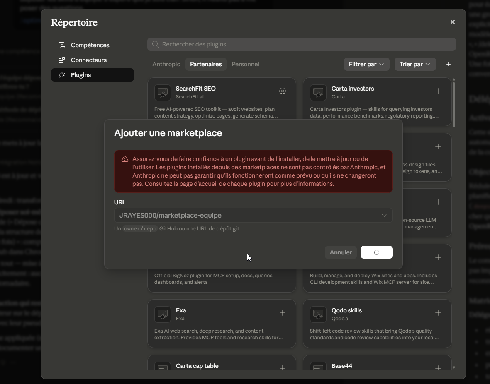

# 🧩 Marketplace Équipe — nos skills Claude partagées

Ce dépôt est le **magasin de skills de l'équipe**. Il remplace l'ancien dossier OneDrive « SHARED SKILLS ».

Il contient le plugin **`skills-equipe`**, qui regroupe nos meilleures skills. Vous l'installez **une seule fois**, et ensuite chaque nouvelle skill (ou mise à jour) arrive **automatiquement** dans votre Claude — plus rien à télécharger.

## 🚀 Installation (une seule fois, 2 minutes)

Dans Claude Desktop (ou Claude Code), tapez :

```
/plugin marketplace add JRAYES000/marketplace-equipe
/plugin install skills-equipe@marketplace-equipe
```

Ou via l'interface : **Réglages → Capacités → Plugins → Ajouter une marketplace** avec l'adresse `JRAYES000/marketplace-equipe`.

Voici l'écran « Ajouter une marketplace » — collez exactement cette URL :



C'est tout. Vérifiez : la skill `delegation-deepseek-openrouter` doit apparaître dans vos capacités.

## 📦 Skills disponibles

| Skill | À quoi ça sert | Auteur |
|---|---|---|
| `delegation-deepseek-openrouter` | Économiser vos tokens Claude Pro en déléguant les grosses tâches (résumés, traductions, gros volumes) à DeepSeek V4 Pro via OpenRouter | Julien |

## ✍️ Proposer une skill (le rituel du vendredi)

1. Dans Claude : « *Transforme tout notre échange en une skill, incluant ma demande initiale et tous mes feedbacks, et exporte-la en fichier .skill.* »
2. Déposez-la vous-même : demandez à Claude « *Dépose cette skill sur le dépôt GitHub JRAYES000/marketplace-equipe : ajoute son dossier dans plugins/skills-equipe/skills/ et incrémente la version dans plugins/skills-equipe/.claude-plugin/plugin.json* ». Nom de la skill en minuscules : `sujet-action` (ex. `seo-audit-page`). Prérequis (une seule fois) : un compte GitHub + l'invitation « Collaborator » de Julien acceptée.
3. C'est tout — toute l'équipe la reçoit automatiquement, aucune validation nécessaire.

## 🔧 Pour le mainteneur (Julien) — mettre à jour

1. Ajouter/modifier un dossier dans `plugins/skills-equipe/skills/` (un dossier = une skill avec son `SKILL.md`)
2. Incrémenter `version` dans `plugins/skills-equipe/.claude-plugin/plugin.json` (ex. 0.1.0 → 0.2.0)
3. Commit + push — les mises à jour se propagent aux membres (au besoin : `/plugin marketplace update marketplace-equipe`)

## ❓ FAQ

**Je ne vois pas les nouvelles skills ?** Relancez Claude, ou tapez `/plugin marketplace update marketplace-equipe`.

**Une skill me semble buguée ?** Dites-le à Julien — il corrige dans le dépôt et tout le monde profite du correctif.

**Je peux modifier une skill directement ici ?** Oui si vous êtes à l'aise avec GitHub : proposez une pull request.
