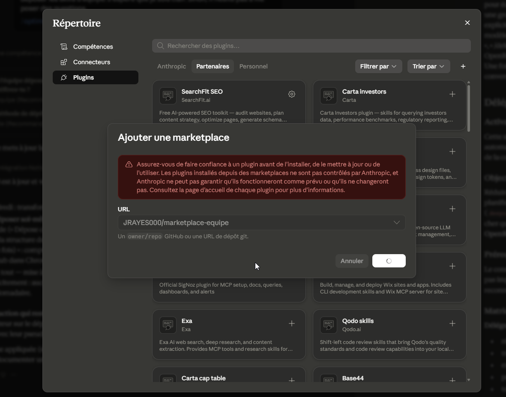

# 🧩 Marketplace Équipe — nos skills Claude partagées

Ici, on range les **skills** de l'équipe. Une skill, c'est une notice que Claude lit tout seul pour mieux faire un travail précis.

Tu installes **une seule fois** le paquet `skills-equipe`. Ensuite, chaque nouvelle skill arrive **toute seule** chez toi. Tu n'as plus rien à télécharger.

## 🚀 Installation (une fois, 2 minutes)

Dans Claude, tape ces deux lignes :

```
/plugin marketplace add JRAYES000/marketplace-equipe
/plugin install skills-equipe@marketplace-equipe
```

Ou avec la souris : **Réglages → Capacités → Plugins → Ajouter une marketplace**, puis colle `JRAYES000/marketplace-equipe`.



**Pour vérifier que ça a marché :** tu dois voir `fonce`, `delegation-deepseek-openrouter`, `phrase-magique` et `parallelisation-et-routage` dans tes capacités.

## 📦 Les skills de l'équipe

Une fois `skills-equipe` installé, les skills arrivent avec le paquet. Tu n'as rien à télécharger.

**Paquet publié : `skills-equipe` 1.3.1.** La colonne *Version* indique la version du paquet dans laquelle chaque skill a été modifiée pour la dernière fois. Si le numéro affiché dans *Réglages → Plugins* est inférieur à 1.3.1, tu n'as pas la dernière version.

| Skill | Version | Ce qu'elle fait |
|---|---|---|
| `fonce` | 1.2.2 | Le mode « je pars, tu gères ». Claude écrit d'abord noir sur blanc à quoi ressemblera « c'est fini » (un test qui passe, une page qui répond), puis il y va tout seul : aucune question, il tranche les doutes lui-même et te dit à la fin ce qu'il a supposé — tu corriges d'un mot si besoin. Il vérifie pour de vrai avant d'annoncer terminé. Tape `/fonce` suivi de ta demande. |
| `phrase-magique` | 1.2.0 | Le mode « travail soigné ». Avant de produire quoi que ce soit, Claude te signale les limites ou les risques qu'il voit, te pose 4 questions (même si ta demande te paraît claire) et, quand c'est une petite tâche, te donne déjà un premier jet dans le même message. Ensuite il écrit noir sur blanc à quoi ressemblera un travail réussi, vérifie vraiment — il ouvre ce qu'il a produit au lieu de supposer que c'est bon — et te dit s'il a raté quelque chose. Une page de règles, pas un manuel : les 17 « phrases magiques » et les preuves qui justifient chaque règle sont rangées à côté, Claude les ouvre seulement quand tu les demandes. Tape `phrase magique` pour l'activer, `mode normal` pour l'arrêter. |
| `parallelisation-et-routage` | 1.3.1 | Le mode « économie ». Claude arrête de tout faire lui-même : il regarde ce que tu demandes, décide quel assistant suffit (Haiku pour le mécanique, Sonnet pour le courant, Opus pour ce qui demande vraiment de réfléchir) et lui passe le travail. Pour un gros lot (50 documents à résumer, 60 lignes à classer, 12 pages à auditer), il découpe et lance plusieurs assistants rapides en même temps. Moins de tokens consommés, et plus rapide. Dis « parallélise ça », « active le routeur » ou « mode économie de tokens » ; `mode normal` pour l'arrêter. |
| `delegation-deepseek-openrouter` | 1.2.1 | Fait faire les grosses tâches (résumés, traductions, gros volumes) par une IA moins chère. Tu économises tes messages Claude. |

> **Attention avec `fonce` :** il décide seul et va jusqu'au bout. Ne le lance pas sur quelque chose que tu ne saurais pas défaire toi-même (mettre le site en ligne, envoyer un message à un client). Pour ça, décris ta demande normalement — Claude te demandera confirmation.

> **Une nouvelle skill n'apparaît pas ?** Les mises à jour ne sont pas instantanées. Va dans **Réglages → Capacités → Plugins**, et rafraîchis (ou désinstalle puis réinstalle `skills-equipe`). Redémarrer Claude Desktop aide aussi.

## ⭐ Les modules à installer toi-même

Ceux-là ne sont pas dans notre paquet : ils appartiennent à Anthropic ou à d'autres gens, qui les mettent à jour de leur côté. Installe ceux qui servent à **ton** travail, pas tous.

Il y a deux façons de les installer :

- **Depuis le catalogue** — *Personnaliser → Plugins → Parcourir les plugins*, tu tapes le nom, tu cliques **Installer**. C'est tout.
- **En ajoutant un magasin** — *Personnaliser → Plugins → **+** → Ajouter une marketplace*, tu colles l'adresse `auteur/dépôt`, tu valides, puis **Installer**.

| Module | Ce qu'il fait | Où le trouver | Comment l'utiliser |
|---|---|---|---|
| **superpowers** | Claude réfléchit et fait un plan **avant** de travailler, puis vérifie ce qu'il a fait. Le plus utile de la liste. | Catalogue : `Superpowers`. Sinon, magasin `obra/superpowers-marketplace` | Rien à faire, il se lance tout seul quand le travail est compliqué |
| **frontend-design** | Fabrique des pages web qui ont l'air faites par un humain, pas par une IA | Catalogue : `frontend-design` | Écris `/frontend-design` |
| **impeccable** | Donne à Claude l'œil d'un vrai graphiste : polices, couleurs, espaces, animations. Il repère aussi ce qui est moche. Va bien avec frontend-design. | Magasin `pbakaus/impeccable` | `/impeccable polish`, `/impeccable audit`, `/impeccable critique` (tape `/` pour voir le reste) |
| **ponytail** | Force Claude à écrire le moins de code possible. Moins de code = moins de bugs. | Magasin `DietrichGebert/ponytail` | Rien à faire, il est actif tout le temps. `/ponytail-review` pour voir ce qu'on peut supprimer |
| **marketing** | Écrire des posts, préparer une campagne, regarder si ça a marché, garder le même ton partout | Catalogue : `Marketing` | Dis simplement ce que tu veux : « prépare une campagne », « écris un post » |
| **searchfit-seo** | Aide le site à sortir dans Google **et** à être cité par les IA (ChatGPT, Perplexity) | Catalogue : `searchfit` | Tape `/` pour voir les commandes, ou explique ce que tu veux |
| **deep-research** | Fait une vraie recherche : il va chercher plusieurs sources et vérifie avant de te répondre. Pratique pour écrire un article sans dire de bêtises. | Skills officielles Anthropic : *Réglages → Capacités → Skills*, tape `deep research` | `/deep-research` puis ta question |
| **doc-coauthoring** | T'accompagne pour écrire un long document ou un article, étape par étape | Skills officielles Anthropic : *Réglages → Capacités → Skills*, tape `doc` | Se lance quand tu écris un document |

> **Tu cherches un module pour écrire des textes de pages web ?** Il n'y en a pas à installer : c'est déjà dans **marketing**. Utilise `/draft-content` pour écrire, `/brand-review` pour faire relire.
>
> **Tu ne trouves pas un de ces modules ?** Relis la colonne « Où le trouver » : ceux qui viennent d'un magasin n'apparaissent dans le catalogue qu'une fois le magasin ajouté. N'installe pas un autre module qui porte un nom qui ressemble.

## 🔌 Les connecteurs (pour brancher tes outils)

Les modules du dessus apprennent à Claude **comment travailler**. Les connecteurs, eux, lui donnent **accès à tes outils** : ton navigateur, le code du site, tes fichiers.

Pour tous : **Personnaliser → onglet Connecteurs → + → Parcourir**, tu tapes le nom, tu cliques **Connecter**.

### À installer

| Connecteur | Ce qu'il fait | Comment |
|---|---|---|
| **Notion** | Ouvrir les pages Notion de l'équipe | Parcourir → `Notion` → Connecter |
| **GitHub** | Lire et modifier le code du site, mettre en ligne | Parcourir → `GitHub` → Connecter. C'est un **compte partagé** : les identifiants te sont remis à ton arrivée, ils ne sont pas écrits ici. Ne change pas le mot de passe et ne l'utilise que pour le travail |
| **Claude in Chrome** | Laisser Claude utiliser ton navigateur : lire des pages, remplir des formulaires. Indispensable dès qu'il faut **être connecté** au site (espace client, back-office, double authentification) | Ce n'est pas un connecteur mais une **extension**. Va sur Chrome → Chrome Web Store → cherche « Claude for Chrome » (par Anthropic) → Ajouter à Chrome → connecte-la à ton compte Claude |
| **OpenRouter** | Un seul compte pour utiliser plein d'autres IA. On s'en sert surtout pour **fabriquer les images** des articles | D'abord, crée un compte gratuit sur [openrouter.ai](https://openrouter.ai). Ensuite, donne ta clé à Claude et demande-lui de la retenir |
| **context7** | Donne à Claude les manuels techniques **à jour** (utile dès qu'on touche à WordPress) | Parcourir → `context7`. Sinon : *Ajouter un connecteur personnalisé* → Nom `context7` → Adresse `https://mcp.context7.com/mcp` |
| **Composio** | Un seul branchement pour accéder à plein d'outils extérieurs, surtout ceux de Google | D'abord, crée ton compte sur [dashboard.composio.dev](https://dashboard.composio.dev) et branches-y tes outils. Ensuite : Parcourir → `Composio` → Connecter |

### Tes fichiers : rien à installer

Pour que Claude lise et écrive tes fichiers, il n'y a **aucun connecteur à brancher**. Dans ton projet, clique **Connecter un dossier** et choisis ton dossier de travail. C'est intégré à Claude, ça marche partout (sur ton ordinateur comme dans le cloud), et Claude ne voit que ce dossier-là.

Fais-le dans tous les cas. Le tableau du dessous, c'est pour des besoins particuliers.

### Seulement si on te le demande

| Connecteur | Ce qu'il fait | Comment |
|---|---|---|
| **Windows MCP** | Piloter les **applications** de ton ordinateur : ouvrir Word ou l'Explorateur, cliquer, taper, faire une capture d'écran. **Pas pour tes fichiers** — pour ça, c'est « Connecter un dossier » | Absent du catalogue : une commande à coller, voir juste en dessous |

**Installer Windows MCP** — une seule fois, sur Windows. Trois gestes, rien à éditer.

1. Ouvre **PowerShell** : touche Windows, tape `powershell`, Entrée.
2. Colle cette ligne, appuie sur Entrée, laisse-la finir :

```powershell
irm https://raw.githubusercontent.com/JRAYES000/marketplace-equipe/main/scripts/install-windows-mcp.ps1 | iex
```

3. Ferme complètement Claude, rouvre-le. Le connecteur apparaît dans *Personnaliser → Connecteurs*.

Le script dit à chaque étape ce qu'il fait. Il sauvegarde ta configuration avant d'y toucher, ne change rien si le connecteur est déjà là, et tu peux le relancer autant de fois que tu veux. Son contenu est lisible ici : [`scripts/install-windows-mcp.ps1`](scripts/install-windows-mcp.ps1).

⚠️ **Windows MCP donne à Claude la main sur tout l'ordinateur** : n'importe quel fichier, n'importe quel dossier, y compris les supprimer. « Connecter un dossier » se limite au dossier que tu as choisi. Quand les deux savent faire le travail, prends toujours « Connecter un dossier ».

✅ **C'est bon quand** : dans *Personnaliser → Connecteurs*, tu vois ta liste et chacun est marqué **connecté**.

🆘 **Ça coince ?** Installe déjà ce qui marche et avance : Notion, Claude in Chrome, OpenRouter et context7 sont les plus faciles, et aucun ne dépend des autres. Les accès partagés (mot de passe d'équipe, comptes communs) te sont remis séparément — ils ne figurent pas dans ce guide.

> Certains projets ont besoin d'accès en plus (WordPress, hébergeur, Search Console…). Ils ne sont pas dans la liste : ils sont branchés au cas par cas, quand un projet en a vraiment besoin.

## ❓ Questions fréquentes

**Je ne vois pas les nouvelles skills — dans Claude Code (terminal).**
Deux commandes, dans cet ordre. La première rafraîchit le catalogue, la seconde met à jour ton installation — l'une sans l'autre ne suffit pas :

```
/plugin marketplace update marketplace-equipe
/plugin update skills-equipe@marketplace-equipe
```

Puis relance Claude Code.

**Je ne vois pas les nouvelles skills — dans Claude Desktop.**
D'abord : **ouvre une nouvelle conversation.** Une conversation déjà commencée garde les skills qu'elle avait à son démarrage — même après une mise à jour, elle continue avec les anciennes. Si une conversation neuve ne suffit pas, relance Claude, puis tape `/plugin marketplace update marketplace-equipe`.

**Le bouton « Mettre à jour » de Claude Desktop est grisé alors que le dépôt a bougé.**
Sur Desktop, le plugin n'est pas installé sur ton ordinateur : il vit sur les serveurs de Claude, qui relisent le dépôt à leur propre rythme. Le numéro affiché dans le panneau est celui qu'**ils** connaissent, pas celui de GitHub — il n'y a donc rien à vider en local, et le bouton s'allumera de lui-même une fois la synchronisation faite. Si c'est urgent, désinstalle et réinstalle le plugin : ça force une relecture immédiate. Claude Code (terminal), lui, lit GitHub en direct — voir les deux commandes ci-dessus.

**Est-ce que ça va effacer mes skills à moi ?**
Non, jamais. Les skills du dépôt sont rangées dans un dossier séparé et portent une étiquette devant leur nom : `skills-equipe:phrase-magique`, `superpowers:brainstorming`. Les tiennes ne bougent pas. Même si deux skills ont exactement le même nom, elles vivent chacune de leur côté — dis le nom complet avec l'étiquette pour choisir laquelle tu veux.

**J'ai déjà installé un de ces modules de mon côté ?**
Aucun souci, tant que tu ne l'installes qu'**une** fois. Évite juste d'installer le **même** module depuis deux magasins différents : tu te retrouverais avec tout en double.

**Une skill a l'air cassée.**
Ouvre une issue sur le dépôt : [github.com/JRAYES000/marketplace-equipe/issues](https://github.com/JRAYES000/marketplace-equipe/issues). Décris ce que tu attendais et ce que Claude a fait. Corrigée une fois, la skill est réparée pour toute l'équipe.

## 🔧 Maintenir le dépôt

1. Ajouter ou modifier un dossier dans `plugins/skills-equipe/skills/` (un dossier = une skill avec son `SKILL.md`)
2. Augmenter `version` dans `plugins/skills-equipe/.claude-plugin/plugin.json` (0.1.0 → 0.2.0). Claude compare des numéros de version, pas des contenus : sans ce bump, il ne voit rien de neuf, le bouton **Mettre à jour** reste grisé chez tout le monde et l'équipe garde l'ancienne skill sans le savoir.
   **Si tu oublies, ce n'est pas grave** : une GitHub Action (`.github/workflows/bump-version.yml`) le détecte et incrémente le patch à ta place, une minute après ton push. Le petit commit `Bump auto` qui apparaît, c'est elle. Un bump à la main reste préférable quand le changement est important — mineur pour une nouvelle skill, majeur pour une refonte
3. Commit + push. Les membres reçoivent la mise à jour au redémarrage de Claude, ou avec `/plugin marketplace update marketplace-equipe`
