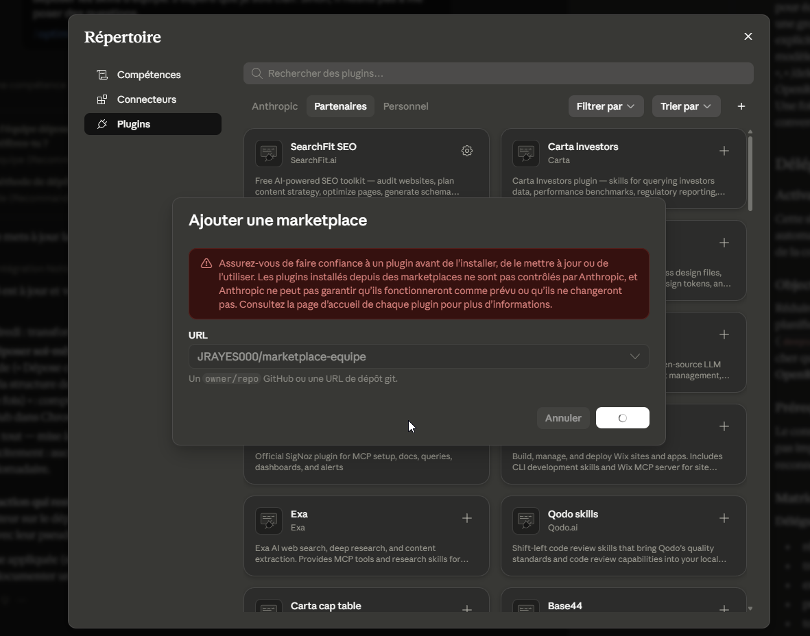

# 🧩 Marketplace Équipe — nos skills Claude partagées

Ici, on range les **skills** de l'équipe. Une skill, c'est une notice que Claude lit tout seul pour mieux faire un travail précis.

Tu installes **une seule fois** le paquet `skills-equipe`. Ensuite, chaque nouvelle skill arrive **toute seule** chez toi. Tu n'as plus rien à télécharger.

## 🚀 Installation (une fois, 2 minutes)

Dans Claude, tape ces deux lignes :

```
/plugin marketplace add JRAYES000/marketplace-equipe
/plugin install skills-equipe@marketplace-equipe
```

Ou avec la souris : **Réglages → Capacités → Plugins → Ajouter une marketplace**, puis colle `JRAYES000/marketplace-equipe`.



**Pour vérifier que ça a marché :** tu dois voir les dix skills dans tes capacités, chacune précédée du nom du paquet — `skills-equipe:phrase-magique`, `skills-equipe:fonce`, `skills-equipe:parallelisation-et-routage`, `skills-equipe:delegation-deepseek-openrouter`, `skills-equipe:linkedin-carrousel`, `skills-equipe:linkedin-commentaires`, `skills-equipe:linkedin-veille-virale`, `skills-equipe:linkedin-mise-en-forme`, `skills-equipe:analyse-reseau-client`, `skills-equipe:france-travail-extraction`.

## 📦 Les skills de l'équipe

Une fois `skills-equipe` installé, les skills arrivent avec le paquet. Tu n'as rien à télécharger.

**Paquet publié : `skills-equipe` 1.32.0.** Si le numéro affiché dans *Réglages → Plugins* est inférieur à 1.32.0, tu n'as pas la dernière version.

**Aucune skill ne s'active toute seule.** Les dix attendent que tu les appelles — en tapant leur nom, ou avec une des formulations données dans la colonne *Ce qu'elle fait*. Une fois lancée, une skill tient jusqu'à ce que tu dises `mode normal`. C'est volontaire : rien ne change ta façon de travailler sans que tu l'aies décidé. Si une skill se déclenche alors que tu ne l'as pas demandée, c'est un bug — ouvre une issue.

Dans le tableau, *Version* est le numéro propre à chaque skill : il avance quand **cette** skill change, indépendamment des autres et du numéro du paquet. *Dernière mise à jour* est la date de ce changement-là.

**Comment on les nomme, une fois pour toutes.** Trois niveaux, un nom par niveau, et jamais deux graphies pour le même objet :

| Niveau | Nom | Où il sert |
|---|---|---|
| Le dépôt | `marketplace-equipe` | uniquement dans la ligne d'installation |
| Le paquet | `skills-equipe` | uniquement pour parler du paquet et de sa version |
| Une skill | `skills-equipe:phrase-magique` | **partout ailleurs** — c'est la forme complète, celle qui ne se confond avec rien |

La colonne *Skill* ci-dessous abrège au nom court pour tenir dans le tableau ; en dehors d'elle, on écrit la forme complète. Pour déclencher une skill, le langage naturel marche aussi (« phrase magique », « parallélise ça ») — c'est un déclencheur, pas un nom.

| Skill | Version | Dernière mise à jour | Ce qu'elle fait |
|---|---|---|---|
| `fonce` | 1.4.2 | 22/09/2026 | Le mode « je pars, tu gères ». Claude écrit d'abord noir sur blanc à quoi ressemblera « c'est fini » (un test qui passe, une page qui répond), puis il y va tout seul : aucune question, il tranche les doutes lui-même et te dit à la fin ce qu'il a supposé — tu corriges d'un mot si besoin. Il vérifie pour de vrai avant d'annoncer terminé. Il tient un fichier de bord (`.fonce.md`, hors git) avec sa condition de fin, ses hypothèses et les pistes déjà essayées : si la conversation se vide ou se reprend plus tard, il repart de là au lieu de tout refaire. Tout ce qui sort du projet sans que tu l'aies demandé (mettre en ligne, envoyer un message) est préparé mais **pas exécuté** : ça t'attend dans le bloc « Reste » du récap, à lancer d'un mot. Tape `/fonce` suivi de ta demande. Dans Claude Code, colle la ligne `/goal …` qu'il affiche en tête pour qu'il enchaîne les tours sans toi ; sans elle, il s'arrête à la fin du premier tour et repart d'un « continue ». Le niveau d'effort se règle avant de lancer, pas pendant : `medium` suffit sur le travail courant, monte d'un cran sur du code exigeant. |
| `phrase-magique` | 1.10.0 | 22/09/2026 | Le mode « travail soigné ». Avant de produire quoi que ce soit, Claude te signale les limites ou les risques qu'il voit, te pose **4 questions en une seule fois** (même si ta demande te paraît claire), remplies au maximum — cases à cocher multiples, aperçus à comparer — et jamais de deuxième salve. Et, quand c'est une petite tâche, il te donne déjà un premier jet dans le même message. Ensuite il écrit noir sur blanc à quoi ressemblera un travail réussi, te dit en une phrase ce qu'il va faire avant de commencer, vérifie vraiment — il ouvre ce qu'il a produit au lieu de supposer que c'est bon — et te dit s'il a raté quelque chose, sans s'excuser trois fois pour une virgule. À la fin il reprend chaque point un par un : FAIT avec la preuve sous les yeux, ou NON CONFORME avec ce qui manque. Sur un gros chantier il écrit le plan dans un fichier, pour que tu puisses vider la conversation sans rien perdre, il s'arrête au lieu de tourner en rond quand ça bloque deux fois de suite, et il te propose de ranger dans le `CLAUDE.md` ou dans une skill ce que tu viens de lui réexpliquer. Une page de règles, pas un manuel : les 17 formulations à réutiliser dans tes propres demandes, et les preuves qui justifient chaque règle, sont rangées à côté — Claude les ouvre seulement quand tu les demandes. Tape `/skills-equipe:phrase-magique` pour l'activer, ou dis simplement « phrase magique ». `mode normal` pour l'arrêter. |
| `parallelisation-et-routage` | 1.4.3 | 22/09/2026 | Le mode « économie ». Claude arrête de tout faire lui-même : il regarde ce que tu demandes, décide quel assistant suffit (Haiku pour le mécanique, Sonnet pour le courant, Opus pour ce qui demande vraiment de réfléchir) et lui passe le travail. Pour un gros lot (50 documents à résumer, 60 lignes à classer, 12 pages à auditer), il découpe et lance plusieurs assistants rapides en même temps. Moins de tokens consommés, et plus rapide. À l'inverse de ce qu'on croit, elle sert surtout à **freiner** : Claude a tendance à lancer des assistants pour des broutilles, et elle lui dit quand ça n'en vaut pas la peine. Dis « parallélise ça », « active le routeur » ou « mode économie de tokens » ; `mode normal` pour l'arrêter. |
| `delegation-deepseek-openrouter` | 1.4.1 | 13/09/2026 | Fait faire les grosses tâches (résumés, traductions, gros volumes) par une IA moins chère. Tu économises tes messages Claude. À réserver au vrai volume : sur une tâche moyenne, baisser l'effort de réflexion de Claude coûte moins cher que l'aller-retour. Nouveau : Claude choisit lui-même entre la petite IA, la grande, et lui-même, en se posant trois questions dans l'ordre. La grande coûte une quinzaine de fois la petite pour presque rien de mieux, donc elle ne sert que sur un cas précis — beaucoup de texte à produire, sans enjeu, mais avec du raisonnement dedans. |
| `linkedin-mise-en-forme` | 1.6.0 | 30/09/2026 | **Contrôle de variété étendu aux 5 derniers posts du compte le 30/09/2026** : `scripts/verif-post.mjs verif <brouillon>` ne compare plus seulement le post précédent. Il lit jusqu'à 5 `.final.txt` du même compte (les 5 derniers strictement avant le brouillon ; à défaut de dossier local, les 5 derniers posts publiés via Zernio) et ajoute le 16e critère « variété sur les 5 derniers posts », qui refuse et nomme le post en cause (n°1 = le plus récent) si le brouillon reprend : le même schéma (accroche, nombre de blocs, fin) qu'un de ces 5 posts ; les 3 premiers mots de l'accroche ; la même dernière ligne mot pour mot (un lien ou une ligne « Source » ne compte pas) ; une même phrase en gras (2 mots minimum). Un même *type* d'accroche ou de fin sur plusieurs posts reste permis (il n'y a que trois types, et finir sur une vraie question est une consigne permanente). Le critère « schéma différent du post précédent » reste. `precedent.mjs` : nouvelles `precedentsLocaux` et `derniersPostsZernio` (`limit=5`), `resoudrePrecedent` renvoie aussi `textes` et `sources`. 10 tests ajoutés (75 au total). **Post précédent branché automatiquement le 30/09/2026** (consigne de Julien du 29/09) : `scripts/verif-post.mjs verif <brouillon>` retrouve seul le post précédent du même compte (`a<N>.final.txt` = julien-agency, `p<N>.final.txt` = julien-partners) — le `.final.txt` le plus récent du compte dans `livrables-Claude-Agency/linkedin/` (chemin configurable : `--dossier` ou `LIVRABLES_LINKEDIN_DIR`), strictement avant le brouillon s'il s'y trouve ; sinon le dernier post publié via l'API Zernio (`GET /v1/posts`, lecture seule, clé jamais affichée) ; sinon un avertissement, sans échec. Options `--precedent`, `--compte`, `--dossier`, `--sans-precedent`. Nouveau `scripts/precedent.mjs`, 13 tests ajoutés (65 au total). **Règle de publication mise à jour dans `CLAUDE.md`** : feu vert permanent pour les posts `julien-agency` et `julien-partners`, le reste garde la règle du feu vert. Premier constat réel : `a6` a le même schéma que `a5`. **Consignes de Julien du 29/09/2026 (mail de 22h08), appliquées le 30/09/2026** : l'accroche est libre (question, prise de position, chiffre ou situation concrète ; les 2 premières lignes doivent donner envie de cliquer sur « … plus », plafond de 140 caractères conservé) ; 1 à 4 blocs, avec ou sans titre, plus d'émojis 👉 ⚡ ✅ imposés (6 au maximum, en tête de ligne) ; fin libre, « Et vous ? » n'est plus obligatoire ; gras : 1 ou 2 passages par post au maximum (remplace « au moins huit ») ; trois tournures interdites de plus (« Notre lecture : », « Testons-la. », « Suivons son regard. »), refusées aussi quand elles sont déjà en gras Unicode ; nouvelle règle de variété : jamais deux posts de suite sur un compte avec la même accroche, le même nombre de blocs et la même fin. `scripts/verif-post.mjs verif <brouillon> [<post-précédent>]` mesure désormais 14 critères (15 avec le post précédent, qu'il ne devine pas). Le contrôle des accents et des anglicismes ne change pas. 52 tests (`npm test`) ; deux fixtures et deux regex de `linkedin-veille-virale` adaptées pour rester au vert (45 tests). **Garde-fou d'accents réparé le 29/09/2026** (la 1re ligne de A4, « Confier l'IA a un seul salarie de l'equipe est-il un risque sous-estime ? », tout en gras sans accent, avait obtenu 14/14). Trois trous cumulés : « l'equipe » restait un seul mot (l'élision n'était pas découpée), « salarie »/« estime »/« sous-estime » existent aussi sans accent (homographes) donc le dictionnaire les jugeait valides, et « a » (une lettre) était ignoré d'office ; le gras Unicode coupé à chaque « ? », « - » ou virgule faisait en plus perdre tout contexte. Le contrôle lit désormais la ligne entière, découpe l'élision et ne juge que les mots en gras : « a » pour « à » (devant un infinitif, en début de phrase, après un infinitif sans sujet), mots en e- (« equipe », « etat »), composés (« peut-etre », « touche-a-tout ») et participes en -e qui existent en -é (après être/avoir, ou composé à préfixe en fin de propos, « sous-estime »). Pas de faux positifs sur « a-t-il », « il a », « l'a », « A4 », « projet », « risque ». Limite : un homographe sans indice de contexte (« un seul salarie ») ne se voit pas sans fréquence d'usage. Deux fixtures de test contenaient elles-mêmes la faute (« a noter » ; « Ce qui a change » dans linkedin-veille-virale) : corrigées. 9 tests ajoutés (44 au total). **Contrôle des anglicismes ajouté le 29/09/2026** (le post A1 du 28/09 était parti avec « process ») : 15e critère bloquant « aucun anglicisme » dans `scripts/verif-post.mjs` — le post est refusé, avec le mot fautif et son équivalent français (`"process" (dites plutôt "processus")`). Le contrôle réutilise la liste de `linkedin-carrousel/lib/valider-anglicismes.js` par import direct, sans copie : un mot ajouté là-bas vaut pour les deux skills. 5 tests ajoutés (« process », « deadline », « feedback », un mot en gras Unicode, un post propre, plus un test qui rejoue toute la liste partagée). **Garde-fou dictionnaire ajouté le 28/09/2026** (demande de Julien, après 3 posts publiés avec un accent retiré à tort dans le gras — « dependance », « coute », « defaillance », « declarent »— que rien ne détectait) : nouveau 14e critère « aucun accent manquant dans le gras », basé sur un dictionnaire français réel (`an-array-of-french-words`, ~336k mots) plutôt qu'une liste maison — un mot en gras dont la forme sans accent n'existe pas mais dont la forme accentuée existe est refusé, le mot fautif nommé ; un anglicisme ou nom propre sans équivalent accentué n'est jamais signalé à tort. 6 tests ajoutés rejouant les 4 cas exacts. Règles de forme obligatoires pour tout post LinkedIn de Julien, sur les deux comptes : accroche formulée en question qui interpelle ou inquiète, au moins huit passages en gras (tous sans accent — le gras Unicode de LinkedIn n'a pas de lettre accentuée), trois sections portant chacune un titre en gras précédé d'un emoji, 3 à 6 emojis en tête de ligne, phrases de 20 mots maximum, corps entre 1 300 et 1 900 caractères. `scripts/verif-post.mjs verif <brouillon>` mesure désormais quinze critères (contre neuf au départ) et sort en code 1 si l'un échoue ; `scripts/verif-post.mjs gras "<segment>"` fabrique le gras et refuse un segment accentué. Test adversarial du 22/09/2026 (même méthode que le 18/09 sur les autres skills LinkedIn) : ajoute un critère « aucun chiffre sans source » (repris de `linkedin-carrousel`, absent jusque-là — un chiffre inventé passait sans encombre) et corrige un contournement réel de la banque de formulations interdites (« C O M M E N T E Z O U I » espacée lettre par lettre, ou séparée par un tiret/de la ponctuation, passait à travers). Documente aussi deux limites sciemment non couvertes (une troisième police Unicode « gras » silencieusement ignorée ; le contrôle de langue de l'accroche, volontairement absent). Logique extraite dans `scripts/lib.mjs`, 35 tests (`npm test`). Se combine avec `contenu-linkedin` (une skill de projet, dans le dépôt `visibilite-ops` — pas une skill de ce paquet, donc pas toujours chargeable selon le dossier de travail), qui dit quoi écrire. |
| `linkedin-carrousel` | 1.10.4 | 29/09/2026 | **Exemple `julien-agency-2026-09-14-v2` débarrassé de « process » le 29/09/2026** (validé par Julien) : diapos 2 et 4, `commentary.txt` et `.brouillon.txt` corrigés (« votre recrutement perd… », « une démarche non pilotée », « votre recrutement hésite », « ce recrutement »), contrôle des anglicismes 0 refus sur les 12 fichiers, 196 tests verts, PDF régénéré en local sans rien publier. Le post publié le 15/09 reste en ligne avec l'ancien texte (correction à la main par Julien). **Garde-fou dictionnaire ajouté le 28/09/2026** (demande de Julien, même incident que `linkedin-mise-en-forme` — la liste fermée `MOTS_SANS_ACCENT_VERS_CORRECT` ne couvrait pas « dependance », « defaillance », « declarent ») : `verifierMotsAccentuesEnGras` (`lib/valider-post.js`) est désormais doublé d'un vrai dictionnaire français (`an-array-of-french-words`, ~336k mots) en plus de la liste fermée existante, qui reste active pour le texte hors gras. 5 tests ajoutés rejouant les 4 cas exacts. **Deux finitions de la checklist recrutement le 26/09/2026** (demande de Julien) : ligne avant la signature reformulée (« Accusés de réception, relances à 48 h : l’IA peut les envoyer pour vous. C’est le métier de Claude Agency. ») ; ligne de source reformulée (« Source du délai de deux semaines (point 2) : Yaggo/Ifop, baromètre expérience candidat, janvier 2026. »). Vérifié par rendu réel (page unique, rien de coupé). **Quatre retouches de la checklist recrutement le 26/09/2026** (demande de Julien) : point 2 ne répétait plus que le titre, remplacé par une action (« Annoncez au candidat la date de votre réponse dès le premier échange »), la ligne de source en bas de page précise désormais qu'elle justifie le délai de deux semaines du point 2 ; point 4 recentré sur une action datée (« Notez la date de chaque échange. Sans nouvelle de vous depuis 48 h, relancez. ») ; une ligne ajoutée avant la signature sur le métier de Claude Agency (accusés de réception et relances automatiques), sans chiffre promis ; `claudeagency.fr` ajouté au pied de page. Vérifié par rendu réel (page unique, rien de coupé, texte foncé ≥14px). **Checklist PDF A4 ajoutée le 26/09/2026 (demande de Julien) : `generer-checklist-pdf.js` produit un lead magnet une page (10 points actionnables avec exemple concret) à partir d'un nouveau gabarit `templates/checklist-a4.html` (mêmes polices/couleurs/logo que les carrousels, canevas 794×1123px = A4 à 96dpi, mesure réelle de la hauteur avant export pour refuser tout débordement). Premier usage : la checklist recrutement promise dans le carrousel julien-agency programmé le 26/09/2026 08:30 Paris (`a-publier/julien-agency-2026-09-26-checklist-recrutement.pdf`), en continuité du carrousel source (même chiffre Yaggo/Ifop, même délai de relance 48h, même réseau de recommandations). « Fais-moi un carrousel » : compose un carrousel LinkedIn (PDF de 6 à 10 pages) pour Claude Agency ou Claude Partners à partir d'un sujet. Refonte complète du dessin le 24/09/2026 (demande de Julien) : 6 modèles de page (accroche, gros chiffre, comparaison, checklist, citation, appel à l'action) au lieu d'un seul ; logo réel, photo de l'auteur et couleurs de marque visibles sur CHAQUE page (avant : masqués sur la page 1) ; polices Bricolage Grotesque + Schibsted Grotesk (mesurées réellement sur les deux sites de marque, plus Fraunces/Inter jugées « IA ») ; emplacement image optionnel signalé explicitement tant que fal.ai n'est pas accessible. Quatre corrections le même jour après relecture du premier carrousel de test : limite de mots relevée à 60 (avant 25) et comptée sur TOUS les champs visibles d'un modèle (titre, texte, chiffre, items, colonnes, citation, auteur, bouton — pas seulement titre+texte comme avant, un vrai trou de couverture) ; nombre de diapos ramené à 6-10 (avant 8-12, conforme au brief initial qui l'avait déjà spécifié) ; numéro de page reformulé en « N/Total » (ex. « 3/10 ») à la place de « 01 », cité par Julien parmi les défauts du dessin ; règle ajoutée interdisant toute citation ou témoignage inventé (incident réel : une citation attribuée à « un dirigeant de PME » sur le carrousel de test, jamais publiée, corrigée avant tout envoi). **Publication reelle basculée sur Zernio le 24/09/2026** (mail de Julien : Composio ne sait publier aucun document/PDF, ce qui partait sous ce canal jusque-là était en réalité une grille d'images, pas un vrai carrousel feuilletable) : `publier-zernio.js <compte> <pdf> <documentTitle> [texte-post.txt] [--publier]`, en trois appels (`POST /v1/media/presign`, upload sur l'URL signée, `POST /v1/posts` avec un média `document` et `platformSpecificData.documentTitle`), avec vérification réelle (`GET /v1/accounts`) que l'`accountId` Zernio utilisé correspond bien au compte demandé avant tout envoi — jamais d'appel `/v1/posts` sans le drapeau `--publier` explicite. `node etat.js` donne un point de situation avant de commencer. **Le 25/09/2026, premier vrai carrousel publié pour julien-agency** (sujet sourcé Bpifrance/Insee) : révèle un bug jamais vu jusque-là, l'emplacement image des modèles checklist/comparaison n'avait aucune règle CSS (introduit le 24/09/2026, jamais utilisé avec une vraie image avant) — une image sans hauteur contrainte faisait déborder le bloc et chevaucher le bandeau logo, corrigé dans les deux templates (hauteur fixe 480px, `object-fit: cover`). Publication automatique désormais actée pour julien-agency et julien-partners uniquement (mail de Julien du 24/09/2026), voir SKILL.md. **Corrigé le 25/09/2026 (même jour, premier carrousel julien-partners)** : le correctif ci-dessus ne s'appliquait en réalité JAMAIS — un second bloc CSS `.image-slot` plus ancien, laissé après la refonte du 24/09, écrasait la hauteur fixe par la cascade (dernière règle du fichier gagne), retirant `height: 480px` et repassant `img { height: auto }`. Trouvé par rendu réel (l'image débordait encore malgré le « correctif »), corrigé en supprimant le bloc dupliqué dans les deux templates, confirmé par les 132 tests (`node --test`) et un nouveau rendu visuel propre. Premier carrousel réel publié pour julien-partners le 25/09/2026, sujet « le temps gagné par l'IA sert-il vraiment à quelque chose, ou isole-t-il davantage ? » (sources Opinium pour OpenAI et Collective.work/Shine), 1 image fal.ai réelle (flux/schnell) sur la diapo checklist — un second essai d'image sur une diapo `comparaison`/`gros-chiffre` a débordé la diapo (texte trop dense pour 480px d'image) et a été retiré plutôt que publié en l'état. **Six corrections le même jour (25/09/2026), après relecture par Julien du carrousel julien-agency publié plus haut** (`urn:li:ugcPost:7509117168333287425`) : photo d'ordinateur à l'écran vide retirée d'une diapo ; titre qui touchait le trait décoratif du haut, corrigé dans les deux gabarits (`.image-slot` réduite de 480px à 380px — un premier correctif avait déplacé le débordement du haut vers le bas plutôt que de le résorber, corrigé après un second rendu réel) ; texte de soutien des pages « gros chiffre » agrandi et assombri (40px gris → 46px encre) dans les deux gabarits ; garde-fou d'accents élargi après une faille réelle (un mot toujours accentué, écrit sans son accent À L'INTÉRIEUR d'un passage en gras, échappait à tout contrôle — `convertirGras` vérifie désormais aussi ces mots, et `documentTitle`, jamais vérifié jusque-là, passe maintenant par le même contrôle avant tout envoi Zernio) ; règle ajoutée — le texte d'un post de carrousel fait 5 lignes maximum (accroche/promesse/appel à l'action), la fourchette 1300-1900 caractères de `linkedin-mise-en-forme` ne s'applique plus ici ; une page utile ajoutée (« Comment choisir votre premier process »). Bug d'environnement trouvé au passage, sans rapport : un `.env` à fins de ligne Windows (CRLF) faisait échouer silencieusement la lecture de `ZERNIO_API_KEY`, corrigé. Carrousel corrigé republié pour julien-agency, ancien post volontairement conservé (Julien fera le ménage lui-même). **Cinq nouveaux garde-fous le même jour (deuxième mail de Julien, 25/09/2026)** : anglicismes courants refusés (process, deadline, feedback, workflow, business...) sur les diapos, le titre du document et le texte du post ; une page « Comment... »/« méthode » sans exemple concret refusée ; modèle « citation » redessiné pour ne plus jamais se lire comme une page vide (fond contrasté plein, guillemet et texte agrandis, vérifié par rendu réel) ; image réelle exigeant désormais un `imagePrompt` tracé, refusé si le sujet est un décor générique (clavier, écran vide...) ; rappel verrouillé par test que les 5 lignes maximum du post et les accents sur les 3 mêmes surfaces restent actifs. Carrousel de test généré et rendu localement, jamais publié. **Bug trouvé en vérifiant ce carrousel (même jour)** : un titre qui se termine par une phrase complète produisait un nom de fichier « ...pourquoi..pdf » (double point) — corrigé par une fonction partagée (`retirerPointFinal`) appliquée au nom de fichier ET au `documentTitle` envoyé à Zernio. **Quatre corrections le même jour après relecture page par page du carrousel de test (deuxième vérification de Nomena)** : une citation attribuée à « Julien Rayes » qu'il n'a jamais publiée — corrigé par un nouveau champ `citationSource` (URL/document réel), sans lequel l'attribution ne s'affiche plus jamais, quel que soit le contenu du champ `auteur` ; toute page qui affiche un chiffre montre désormais sa source en petit en bas de page, refusée sinon par le validateur ; texte de corps unifié (gris/taille) sur tous les modèles, plus une consigne « page fusionnée plutôt que laissée à moitié vide » ; règle « un seul fil » ajoutée (exemples, avant/après et chiffres doivent tous servir le sujet de l'accroche — incident réel : un chiffre sur l'adoption de l'IA glissé sous un hook sur la disparition des candidats, vrai mais hors sujet). Carrousel de test régénéré avec un sujet cohérent de bout en bout, un vrai chiffre sourcé (France Travail) et une vraie image fal.ai déjà présente dans le dépôt. **Troisième relecture le même jour, 3 corrections** : la page 5 débordait réellement (titre qui touchait le trait du haut, image jusqu'au pied de page) — corrigée sur ce carrousel (image déplacée sur une page moins chargée) ET nouveau garde-fou `validerEspacementReel` qui mesure par rendu Playwright réel l'écart haut/bas de chaque page, refuse sinon ; l'appel à l'action « En savoir plus » ne menait nulle part dans un PDF — remplacé par une action concrète faisable depuis LinkedIn, et un garde-fou réutilise désormais la banque de formulations interdites du texte du post sur le modèle « cta » ; le chiffre ne prouvait pas l'accroche — remplacé par une vraie donnée sourcée (Yaggo/Ifop, janvier 2026) qui mesure exactement ce que l'accroche annonce, après une recherche qui a écarté un chiffre circulant sur plusieurs blogs sans source primaire vérifiable. **Programmation ajoutée le 26/09/2026** (demande de Julien) : `publier-zernio.js` accepte désormais `--schedule <scheduledFor> <timezone>` (heure locale ISO + fuseau IANA, ex. « 2026-09-26T08:30:00 » / « Europe/Paris »), confirmé réel en lisant directement l'exemple officiel de `docs.zernio.com/quickstart` — `publishNow` passe automatiquement à `false` dès qu'une programmation est demandée, jamais les deux en même temps. |
| `linkedin-commentaires` | 1.2.12 | 30/09/2026 | **Corrigé le 30/09/2026** : `lib/notion.js` définissait `appelNotion` sans l'exporter, ce qui faisait planter tout script de création de lignes Notion qui l'importait (`appelNotion is not a function`) ; il est désormais exporté, sans changer le comportement des autres fonctions. **Corrigé le 30/09/2026** : le canal MCP Composio (`connect.composio.dev/mcp`) ne renvoie plus d'en-tête `Mcp-Session-Id` (serveur sans état) et `lib/composio.js` refusait alors toute publication Agency (« aucun Mcp-Session-Id recu ») ; l'en-tête étant facultatif dans le protocole MCP, la session absente est désormais tolérée (aucun en-tête envoyé ensuite), seuls les vrais échecs (HTTP ≠ 200, réponse illisible) restent des erreurs. **Sortie du dry-run isolée le 29/09/2026** : `dry-run.js` n'écrit plus jamais la fixture versionnée `commentaires-exemple-fixture.json` (un dry-run avec une clé Apify réelle y déposait des identifiants de vrais posts LinkedIn dans un dépôt public) ; le résultat va dans `dry-run-sortie/dernier-dry-run.json`, ignoré par git, et la fixture n'est plus que lue. **Chargement autonome du `.env` ajouté le 29/09/2026** (même mécanisme que `linkedin-carrousel`) : `dry-run.js`, `creer-page-notion.js` et `mettre-a-jour-stats.js` lisent désormais le `.env` de la skill au démarrage, une clé déjà dans l'environnement restant prioritaire ; sans clé, le script s'arrête avec un message explicite, jamais de repli fixture silencieux. « Les commentaires du jour » : trouve des posts récents (moins de 4h en priorité) sous des comptes ciblés pour Claude Agency ou Claude Partners, et rédige un commentaire sur mesure dans l'un des quatre genres prévus — jamais une expérience inventée sans confirmation réelle, jamais plus de 5 par jour ni deux fois la même personne. Publie désormais chaque compte sur son bon canal (Claude Agency et Claude Partners ne partagent plus la même connexion), et journalise aussi les échecs de publication, pas seulement les succès. **Corrigé le 25/09/2026** : un post publié dans un groupe LinkedIn (ex. « NBC Réseaux d'Affaires ») pouvait être retenu comme candidat prioritaire par la fenêtre de fraîcheur puis refusé par LinkedIn à la publication (403, aucun compte n'a la permission de commenter dans un groupe) — `estPostDeGroupe` (`lib/trouver-posts.js`) écarte désormais ces posts avant même le tri par fraîcheur. Corrige le 22/09/2026 un vrai contournement trouvé par test adversarial : un domaine nu sans « www. » ni « http(s):// » (ex. « monsite.fr », « bit.ly/abc123 ») échappait entièrement à l'interdiction de lien. Même correctif de `valider-orthographe.js` que `linkedin-carrousel`. Deuxième passage adversarial le même jour, 3 failles réelles corrigées : un lien avec espaces insérés autour du point (« mon site . fr ») échappait aussi à l'interdiction ; une variation d'espace interne dans le nom d'une personne ciblée (double espace, tabulation) contournait « jamais deux fois la même personne » ; une date de publication future ou non parsable passait le plafond dur de fraîcheur de 48h sans erreur (comparaison silencieusement fausse avec `NaN`). `node etat.js` donne le quota du jour avant de commencer. |
| `linkedin-veille-virale` | 0.3.3 | 30/09/2026 | **Corrigé le 30/09/2026** : `lib/notion.js` définissait `appelNotion` sans l'exporter (`appelNotion is not a function` pour tout script qui l'importait) ; il est désormais exporté, comportement des autres fonctions inchangé. **Sortie du dry-run isolée le 29/09/2026** : `dry-run.js` n'écrit plus jamais la fixture versionnée `veille-exemple-fixture.json` (même correctif que `linkedin-commentaires` 1.2.10) ; le résultat va dans `dry-run-sortie/dernier-dry-run.json`, ignoré par git. **Chargement autonome du `.env` ajouté le 29/09/2026** (même mécanisme que `linkedin-carrousel`) : `dry-run.js`, `creer-page-notion.js`, `mettre-a-jour-stats.js` et `bilan.js` lisent désormais le `.env` de la skill au démarrage, une clé déjà dans l'environnement restant prioritaire ; sans clé, le script s'arrête avec un message explicite, jamais de repli fixture silencieux. « Fais la veille du jour » : surveille des comptes LinkedIn suivis, calcule un vrai score d'engagement (réactions, commentaires, partages rapportés aux abonnés) et propose un post recyclé/inspiré pour Claude Agency ou Claude Partners — jamais deux fois le même jour, jamais plus de trois par semaine, vérifié contre un registre réel. Rebranché le 22/09/2026 sur les critères de `linkedin-mise-en-forme` (import réel, `lib/valider-mise-en-forme.js`) au lieu des 3 critères repris jusque-là de `linkedin-carrousel` — les deux posts déjà publiés (Bernard Marr, Andrew Ng) n'auraient obtenu que 6-7/13 sur le vrai barème. Ses propres garde-fous de quota/registre (date stricte AAAA-MM-JJ, semaine lundi-dimanche) ont été passés au crible par le même test adversarial du 22/09/2026 sans qu'aucun contournement n'y soit trouvé — déjà durcis lors de l'audit du 15/09/2026. La voie réelle actuelle (Buffer, geste manuel) reste hors de portée de ce garde-fou. `node etat.js` donne un point de situation avant de commencer. |
| `analyse-reseau-client` | 1.1.0 | 24/09/2026 | « Analyse le compte Instagram du client X », « fais l'onglet Twitter de Y » ou « fais l'onglet YouTube de Z » : Claude relève les vrais chiffres du compte, publication par publication, repère ce qui marche et ce qui ne marche pas, compare avec des comptes du même métier, te conseille des outils avec leur prix du jour, et écrit l'onglet que le client lit dans son espace. Avant d'écrire, il te pose les questions que le dossier du client ne tranche pas. Il ne met jamais rien d'interne dans la page du client, la contrôle avec un script avant de la pousser, et laisse une note datée à l'équipe dans le `CLAUDE.md` du client. Pour lire **tous** les posts Instagram, il faut ton propre compte Instagram connecté dans Chrome : sans compte, une partie des posts est cachée. Même chose pour X : ton compte X connecté dans Chrome. Instagram, X et YouTube pour l'instant. |
| `france-travail-extraction` | 9.3 | 29/09/2026 | « Extrais des candidats France Travail » : Claude va dans l'espace recruteur France Travail Pro, parcourt les profils d'une recherche que tu choisis (mots-clés, nombre, filtres), télécharge les CV, en lit l'email et le téléphone, puis range tout dans la base Notion « Leads France Travail », qui fait foi. La table NocoDB du même nom est ensuite alignée sur Notion à la fin de chaque lot, automatiquement : n'y corrige rien à la main, corrige dans Notion. Si Notion est indisponible, les fiches attendent sur ton poste et repartent au lot suivant. Chaque CV est rattaché au bon candidat par un script qui vérifie le nom écrit dans le CV : si un doute reste, l'email est laissé vide plutôt que mis au mauvais nom. Les profils déjà en base sont reconnus à leur nom et sautés tout de suite : le nombre que tu demandes est un nombre de **nouveaux** profils. Les profils hors cible d'un lot précédent sont sautés aussi, sans être écrits nulle part : ton poste en garde seulement une empreinte, six mois au plus. Chaque fiche reçoit en « Note » le texte de présentation que le candidat a écrit sur son profil. Si la recherche est enregistrée sur France Travail, Claude la relance en un clic. À la fin du lot, les CV et fichiers de travail partent à la corbeille. Il faut Chrome avec l'extension Claude in Chrome, **ton compte recruteur déjà connecté** (la double authentification se fait de ton côté), et l'accès à Notion (connexion « Leads France Travail - API ») et à NocoDB. Tu dois basculer une fois sur l'onglet au début ; ensuite Claude travaille en arrière-plan et tu reprends ton écran. En fin de lot, les nouvelles fiches avec email et prénom entrent automatiquement dans la séquence SalesHandy « Leads France Travail — reconversion (École Naturo) » et passent « Importe SalesHandy » dans Notion : c'est la séquence qui leur écrit, selon son planning (il faut la clé API SalesHandy du coffre). Claude n'écrit jamais lui-même à un candidat. L'extraction est autorisée par la convention CVthèque signée avec France Travail le 29/09/2026 ; elle impose d'informer chaque candidat de ses droits au premier contact et de supprimer sa fiche au bout de 24 mois sans contact. |

> **Attention avec `fonce` :** il décide seul et va jusqu'au bout de ce que tu as demandé. Ce que tu n'as pas demandé et qui sort du projet (mettre le site en ligne, envoyer un message à un client), il ne le fait pas : il le laisse prêt dans « Reste ». Mais si ta demande le nomme, il le fait sans confirmation — relis ta phrase avant de taper `/fonce`.

> **Une nouvelle skill n'apparaît pas ?** Les mises à jour ne sont pas instantanées. Va dans **Réglages → Capacités → Plugins**, et rafraîchis (ou désinstalle puis réinstalle `skills-equipe`). Redémarrer Claude Desktop aide aussi.

## 🧱 Les mods (à installer un par un)

Un mod change ce que tu vois dans Claude Code : une ligne d'info sous le prompt, des boutons au-dessus, une question avant une action. Il marche dans l'app desktop (onglet Code) et dans le terminal.

**Attention : un mod s'active tout seul dès qu'il est installé.** C'est pour ça qu'ils ne sont pas dans `skills-equipe` : tu choisis lesquels tu veux. Pour en retirer un, désinstalle-le.

Pour en installer un, tape dans Claude Code :

```
/plugin install next-steps@marketplace-equipe
```

Remplace `next-steps` par le nom du mod voulu. Le mod apparaît à la prochaine conversation.

| Mod | Version | Dernière mise à jour | Ce qu'il fait |
|---|---|---|---|
| `next-steps` | 0.4.0 | 03/10/2026 | À la fin de chaque réponse, trois idées de « prochaine étape » s'affichent au-dessus du prompt. Un clic (ou la touche 1, 2 ou 3) l'envoie à Claude. Tu peux aussi taper « 1 et 3 » dans le prompt : Claude reçoit les deux étapes, dans l'ordre. **Ignorer** les fait disparaître. `/next-steps off` le coupe, `/next-steps on` le remet. Rien n'est proposé quand Claude vient de te poser une question, ni après une commande (`/handoff`, une skill…) ou un compactage. Chaque suggestion consomme un peu de ton quota. |
| `cache-keeper` | 0.6.0 | 03/10/2026 | Une rangée de jauges colorées au-dessus du prompt (vert ça va, orange attention, rouge il faut agir) : combien de minutes il reste avant que Claude « oublie » la conversation en mémoire rapide (le cache), la taille de la conversation avec une météo (☀ dégagé, ☁ nuageux, ☂ averses, ☇ orage, ↯ compacter bientôt), une mini-courbe des 12 derniers échanges et ce que le dernier a ajouté, ton quota de la session de 5 h et de la semaine, avec le temps avant leur remise à zéro. La durée de la mémoire rapide (1 h ou 5 min) est mesurée pour de vrai : elle tombe à 5 min quand un quota est dépassé. Quand la mémoire est presque ou déjà vidée, la jauge dit combien de texte le prochain message devra relire. Si tu envoies un message alors qu'elle est vidée et que la conversation est longue, il est mis de côté : **Compacter puis envoyer**, **Envoyer quand même** ou **Annuler**. Une notification te prévient aussi si la mémoire a été vidée sans raison apparente. À droite, deux boutons : **Compact** résume la conversation pour libérer de la place (un message « Compactage en cours… » s’affiche pendant l’opération) ; **Handoff** fait écrire à Claude un document de passation (il faut la skill `/handoff`) ; une fois prêt, **Clear et reprendre** vide la conversation et repart de ce document. 5 minutes avant l'oubli, un bandeau propose **Garder au chaud** (relance la mémoire), **Compacter** ou **Ignorer**. `/cache` affiche l'état. |

## ⭐ Les modules à installer toi-même

Ceux-là ne sont pas dans notre paquet : ils appartiennent à Anthropic ou à d'autres gens, qui les mettent à jour de leur côté. Installe ceux qui servent à **ton** travail, pas tous.

La règle du dessus — rien ne s'active sans que tu le demandes — ne s'applique pas ici : ce sont les modules des autres, et certains se lancent tout seuls. `superpowers` par exemple démarre de lui-même quand le travail est compliqué. C'est normal, et c'est marqué dans la colonne « Comment l'utiliser ».

Il y a deux façons de les installer :

- **Depuis le catalogue** — *Personnaliser → Plugins → Parcourir les plugins*, tu tapes le nom, tu cliques **Installer**. C'est tout.
- **En ajoutant un magasin** — *Personnaliser → Plugins → **+** → Ajouter une marketplace*, tu colles l'adresse `auteur/dépôt`, tu valides, puis **Installer**.

| Module | Ce qu'il fait | Où le trouver | Comment l'utiliser |
|---|---|---|---|
| **superpowers** | Claude réfléchit et fait un plan **avant** de travailler, puis vérifie ce qu'il a fait. Le plus utile de la liste. | Catalogue : `Superpowers`. Sinon, magasin `obra/superpowers-marketplace` | Rien à faire, il se lance tout seul quand le travail est compliqué |
| **frontend-design** | Fabrique des pages web qui ont l'air faites par un humain, pas par une IA | Catalogue : `frontend-design` | Écris `/frontend-design` |
| **impeccable** | Donne à Claude l'œil d'un vrai graphiste : polices, couleurs, espaces, animations. Il repère aussi ce qui est moche. Va bien avec frontend-design. | Magasin `pbakaus/impeccable` | `/impeccable polish`, `/impeccable audit`, `/impeccable critique` (tape `/` pour voir le reste) |
| **marketing** | Écrire des posts, préparer une campagne, regarder si ça a marché, garder le même ton partout | Catalogue : `Marketing` | Dis simplement ce que tu veux : « prépare une campagne », « écris un post » |
| **searchfit-seo** | Aide le site à sortir dans Google **et** à être cité par les IA (ChatGPT, Perplexity) | Catalogue : `searchfit` | Tape `/` pour voir les commandes, ou explique ce que tu veux |
| **deep-research** | Fait une vraie recherche : il va chercher plusieurs sources et vérifie avant de te répondre. Pratique pour écrire un article sans dire de bêtises. | Skills officielles Anthropic : *Réglages → Capacités → Skills*, tape `deep research` | `/deep-research` puis ta question |
| **doc-coauthoring** | T'accompagne pour écrire un long document ou un article, étape par étape | Skills officielles Anthropic : *Réglages → Capacités → Skills*, tape `doc` | Se lance quand tu écris un document |

> **`ponytail` est revenu au module public.** Notre copie `skills-equipe:ponytail` a été retirée du paquet le 04/09/2026 : c'était le même texte en double, et c'est la version publique qui tourne pour de vrai — elle s'active toute seule à chaque session, ce que la nôtre ne faisait pas. **Installe le magasin `DietrichGebert/ponytail`** ; la skill s'appelle alors `ponytail:ponytail`.
>
> **Tu cherches un module pour écrire des textes de pages web ?** Il n'y en a pas à installer : c'est déjà dans **marketing**. Utilise `/draft-content` pour écrire, `/brand-review` pour faire relire.
>
> **Tu ne trouves pas un de ces modules ?** Relis la colonne « Où le trouver » : ceux qui viennent d'un magasin n'apparaissent dans le catalogue qu'une fois le magasin ajouté. N'installe pas un autre module qui porte un nom qui ressemble.

## 🔌 Les connecteurs (pour brancher tes outils)

Les modules du dessus apprennent à Claude **comment travailler**. Les connecteurs, eux, lui donnent **accès à tes outils** : ton navigateur, le code du site, tes fichiers.

Pour tous : **Personnaliser → onglet Connecteurs → + → Parcourir**, tu tapes le nom, tu cliques **Connecter**.

### À installer

| Connecteur | Ce qu'il fait | Comment |
|---|---|---|
| **Notion** | Ouvrir les pages Notion de l'équipe | Parcourir → `Notion` → Connecter |
| **GitHub** | Lire et modifier le code du site, mettre en ligne | Parcourir → `GitHub` → Connecter. C'est un **compte partagé** : les identifiants te sont remis à ton arrivée, ils ne sont pas écrits ici. Ne change pas le mot de passe et ne l'utilise que pour le travail |
| **Claude in Chrome** | Laisser Claude utiliser ton navigateur : lire des pages, remplir des formulaires. Indispensable dès qu'il faut **être connecté** au site (espace client, back-office, double authentification) | Ce n'est pas un connecteur mais une **extension**. Va sur Chrome → Chrome Web Store → cherche « Claude for Chrome » (par Anthropic) → Ajouter à Chrome → connecte-la à ton compte Claude |
| **OpenRouter** | Un seul compte pour utiliser plein d'autres IA. On s'en sert surtout pour **fabriquer les images** des articles | D'abord, crée un compte gratuit sur [openrouter.ai](https://openrouter.ai). Ensuite, donne ta clé à Claude et demande-lui de la retenir |
| **context7** | Donne à Claude les manuels techniques **à jour** (utile dès qu'on touche à WordPress) | Parcourir → `context7`. Sinon : *Ajouter un connecteur personnalisé* → Nom `context7` → Adresse `https://mcp.context7.com/mcp` |
| **Composio** | Un seul branchement pour accéder à plein d'outils extérieurs, surtout ceux de Google | D'abord, crée ton compte sur [dashboard.composio.dev](https://dashboard.composio.dev) et branches-y tes outils. Ensuite : Parcourir → `Composio` → Connecter |

### Tes fichiers : rien à installer

Pour que Claude lise et écrive tes fichiers, il n'y a **aucun connecteur à brancher**. Dans ton projet, clique **Connecter un dossier** et choisis ton dossier de travail. C'est intégré à Claude, ça marche partout (sur ton ordinateur comme dans le cloud), et Claude ne voit que ce dossier-là.

Fais-le dans tous les cas. Le tableau du dessous, c'est pour des besoins particuliers.

### Seulement si on te le demande

| Connecteur | Ce qu'il fait | Comment |
|---|---|---|
| **Windows MCP** | Piloter les **applications** de ton ordinateur : ouvrir Word ou l'Explorateur, cliquer, taper, faire une capture d'écran. **Pas pour tes fichiers** — pour ça, c'est « Connecter un dossier » | Absent du catalogue : une commande à coller, voir juste en dessous |

**Installer Windows MCP** — une seule fois, sur Windows. Trois gestes, rien à éditer.

1. Ouvre **PowerShell** : touche Windows, tape `powershell`, Entrée.
2. Colle cette ligne, appuie sur Entrée, laisse-la finir :

```powershell
irm https://raw.githubusercontent.com/JRAYES000/marketplace-equipe/main/scripts/install-windows-mcp.ps1 | iex
```

3. Ferme complètement Claude, rouvre-le. Le connecteur apparaît dans *Personnaliser → Connecteurs*.

Le script dit à chaque étape ce qu'il fait. Il sauvegarde ta configuration avant d'y toucher, ne change rien si le connecteur est déjà là, et tu peux le relancer autant de fois que tu veux. Son contenu est lisible ici : [`scripts/install-windows-mcp.ps1`](scripts/install-windows-mcp.ps1).

⚠️ **Windows MCP donne à Claude la main sur tout l'ordinateur** : n'importe quel fichier, n'importe quel dossier, y compris les supprimer. « Connecter un dossier » se limite au dossier que tu as choisi. Quand les deux savent faire le travail, prends toujours « Connecter un dossier ».

✅ **C'est bon quand** : dans *Personnaliser → Connecteurs*, tu vois ta liste et chacun est marqué **connecté**.

🆘 **Ça coince ?** Installe déjà ce qui marche et avance : Notion, Claude in Chrome, OpenRouter et context7 sont les plus faciles, et aucun ne dépend des autres. Les accès partagés (mot de passe d'équipe, comptes communs) te sont remis séparément — ils ne figurent pas dans ce guide.

> Certains projets ont besoin d'accès en plus (WordPress, hébergeur, Search Console…). Ils ne sont pas dans la liste : ils sont branchés au cas par cas, quand un projet en a vraiment besoin.

## ❓ Questions fréquentes

**Je ne vois pas les nouvelles skills — dans Claude Code (terminal).**
Deux commandes, dans cet ordre. La première rafraîchit le catalogue, la seconde met à jour ton installation — l'une sans l'autre ne suffit pas :

```
/plugin marketplace update marketplace-equipe
/plugin update skills-equipe@marketplace-equipe
```

Puis relance Claude Code.

**Je ne vois pas les nouvelles skills — dans Claude Desktop.**
D'abord : **ouvre une nouvelle conversation.** Une conversation déjà commencée garde les skills qu'elle avait à son démarrage — même après une mise à jour, elle continue avec les anciennes. Si une conversation neuve ne suffit pas, relance Claude, puis tape `/plugin marketplace update marketplace-equipe`.

**Le bouton « Mettre à jour » de Claude Desktop est grisé alors que le dépôt a bougé.**
Sur Desktop, le plugin n'est pas installé sur ton ordinateur : il vit sur les serveurs de Claude, qui relisent le dépôt à leur propre rythme. Le numéro affiché dans le panneau est celui qu'**ils** connaissent, pas celui de GitHub — il n'y a donc rien à vider en local, et le bouton s'allumera de lui-même une fois la synchronisation faite. Si c'est urgent, désinstalle et réinstalle le plugin : ça force une relecture immédiate. Claude Code (terminal), lui, lit GitHub en direct — voir les deux commandes ci-dessus.

**Est-ce que ça va effacer mes skills à moi ?**
Non, jamais. Les skills du dépôt sont rangées dans un dossier séparé et portent une étiquette devant leur nom : `skills-equipe:phrase-magique`, `superpowers:brainstorming`. Les tiennes ne bougent pas. Même si deux skills ont exactement le même nom, elles vivent chacune de leur côté — dis le nom complet avec l'étiquette pour choisir laquelle tu veux.

**J'ai déjà installé un de ces modules de mon côté ?**
Aucun souci, tant que tu ne l'installes qu'**une** fois. Évite juste d'installer le **même** module depuis deux magasins différents : tu te retrouverais avec tout en double.

**Une skill a l'air cassée.**
Ouvre une issue sur le dépôt : [github.com/JRAYES000/marketplace-equipe/issues](https://github.com/JRAYES000/marketplace-equipe/issues). Décris ce que tu attendais et ce que Claude a fait. Corrigée une fois, la skill est réparée pour toute l'équipe.

## 🔧 Maintenir le dépôt

1. Ajouter ou modifier un dossier dans `plugins/skills-equipe/skills/` (un dossier = une skill avec son `SKILL.md`)
2. Augmenter `version` dans `plugins/skills-equipe/.claude-plugin/plugin.json` (0.1.0 → 0.2.0). Claude compare des numéros de version, pas des contenus : sans ce bump, il ne voit rien de neuf, le bouton **Mettre à jour** reste grisé chez tout le monde et l'équipe garde l'ancienne skill sans le savoir.
   **Si tu oublies, ce n'est pas grave** : une GitHub Action (`.github/workflows/bump-version.yml`) le détecte et incrémente le patch à ta place, une minute après ton push. Le petit commit `Bump auto` qui apparaît, c'est elle. Un bump à la main reste préférable quand le changement est important — mineur pour une nouvelle skill, majeur pour une refonte
3. Commit + push. Les membres reçoivent la mise à jour au redémarrage de Claude, ou avec `/plugin marketplace update marketplace-equipe`
